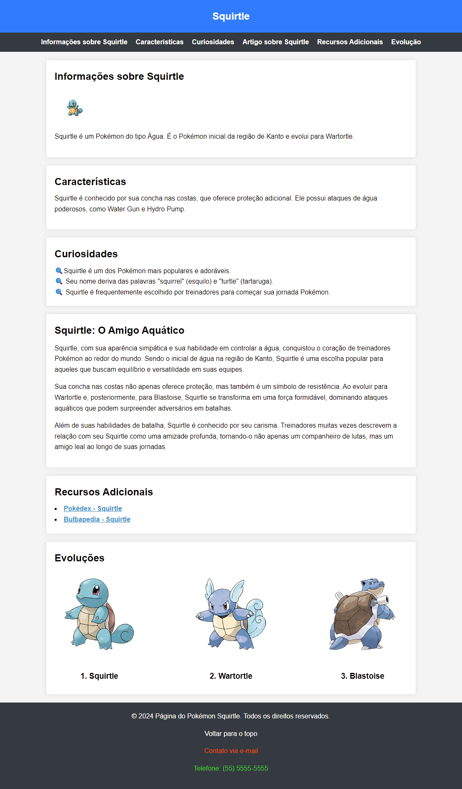

# Atividade

A partir do arquivo [pokemon-acessibilidade.html](../2024-02-27/exemplos/pokemon-acessibilidade.html) façam as seguintes alterações:

- Alterar a nav para ficar colada ao header;
- Remover as margens dos itens da lista da nav;
- Trocar a cor dos links da nav para `#ffc107` quando o mouse estiver sobre eles;
- Trocar o indicador \* da lista de curiosidades para 🔍;
- Adicionar as imagens de cada evolução do Squirtle na lista da seção de evoluções;
  - Utilizar uma lista desordenada e deixar cada imagem e seu nome em um item da lista;
  - [Imagem do Squirtle](https://assets.pokemon.com/assets/cms2/img/pokedex/detail/007.png);
  - [Imagem do Wartortle](https://assets.pokemon.com/assets/cms2/img/pokedex/detail/008.png);
  - [Imagem do Blastoise](https://assets.pokemon.com/assets/cms2/img/pokedex/detail/009.png);
  - Para deixar o conteúdo em uma única linha, utilizar os estilos `display: flex; e justify-content: space-between`;.
- Trocar a cor dos links com atributo `target='\_blank'` para `#4592c4` e deixar a fonte em negrito;
- Utilizando seletores de atributos, trocar as cores dos links do footer para: `white`, `orangered` e `limegreen`;
- Adicionar o estilo `opacity: 0.8`; para os links do footer quando o mouse estiver sobre eles;
- Adicionar o mesmo estilo para os links da seção Recursos Adicionais.

Exercício extra, para quem conseguir terminar antes do final da aula:
Adicionar uma área clicável em cada imagem da lista de evoluções, que redireciona para a página da evolução no [Bulbapedia](https://bulbapedia.bulbagarden.net/wiki/).

---

Página esperada:

[Forms](https://forms.gle/5k8LfHvEPuDA5WSd9)
