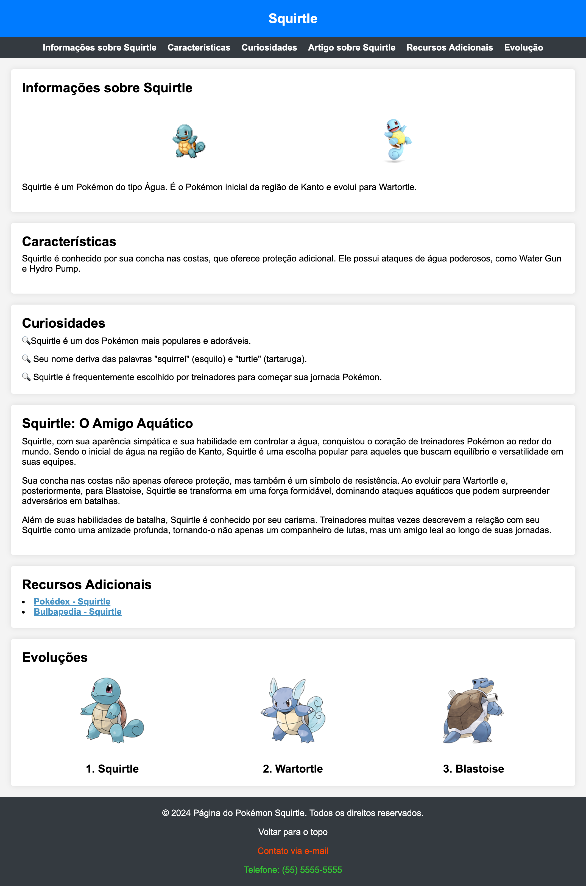

## Atividade JavaScript

A partir dos arquivos `index.html` e `styles.css` fornecidos, crie um arquivo script.js que crie a página do Squirtle que fizemos durante o bimestre passado. **Sendo a única diferença que não haverá navegação ao clicar nas evoluções**.

Link do forms para enviar a atividade, até dia 25/05: https://forms.gle/A6j6ZTX4YaUosAqT9

#### Observações:

- Não modifique o arquivo `index.html` e `style.css` fornecidos. Apenas altere o arquivo `script.js`, que deverá ser criado.

- Não crie elementos utilizando `.innerHTML`.

- Prefira `document.querySelector`, `document.createElement`, `.appendChild` e `classList.add` para manipular o DOM.

- A página deverá ficar com esse visual:

